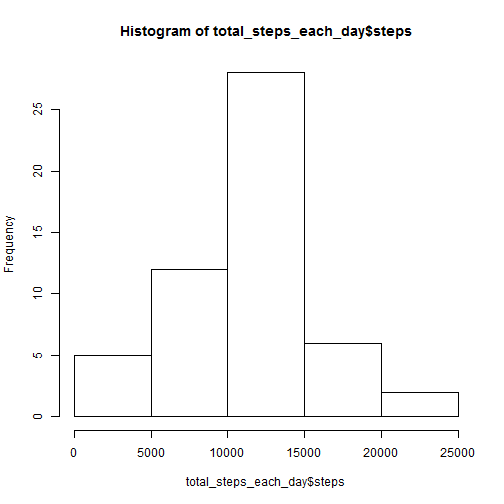
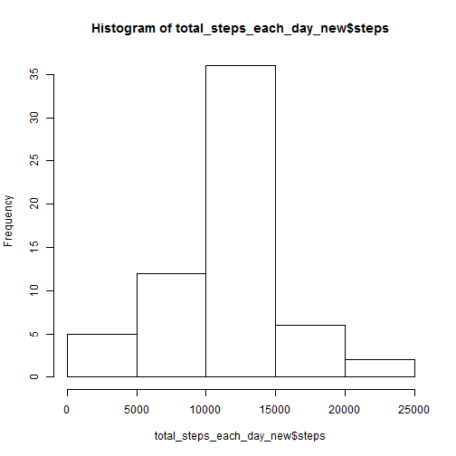

Reproduciable Research Peer Assessment 1
========================================================

Loading and preproceesing the data

Load the data

```r
setInternet2(TRUE)
temp=tempfile()
download.file("https://d396qusza40orc.cloudfront.net/repdata%2Fdata%2Factivity.zip",temp)
dat1 <- read.csv(unz(temp,"activity.csv"), header=TRUE ,sep=",")
summary(dat1)
```

```
##      steps               date          interval   
##  Min.   :  0.0   2012-10-01:  288   Min.   :   0  
##  1st Qu.:  0.0   2012-10-02:  288   1st Qu.: 589  
##  Median :  0.0   2012-10-03:  288   Median :1178  
##  Mean   : 37.4   2012-10-04:  288   Mean   :1178  
##  3rd Qu.: 12.0   2012-10-05:  288   3rd Qu.:1766  
##  Max.   :806.0   2012-10-06:  288   Max.   :2355  
##  NA's   :2304    (Other)   :15840
```

Mean total number of steps taken per day

Histogarm of the total number of steps taken each day

```r
total_steps_each_day<-aggregate(steps ~ date,dat1,sum)
hist(total_steps_each_day$steps)
```

 

Mean and median total number of steps taken per day

```r
x<-summary(total_steps_each_day,na.rm=TRUE)
x[4,2]
```

```
## [1] "Mean   :10766  "
```

```r
x[3,2]
```

```
## [1] "Median :10765  "
```

Average daily activity pattern

Make a time series plot

```r
dat2<-aggregate(steps~interval,dat1, mean)
total<-merge(dat1, dat2, by="interval",all.x=TRUE)
plot(steps.y~interval,total,type = "l",ylab="number of steps")
```

 

```r
maxInterval=total[which.max(total$steps.y),1]
maxSteps=max(total$steps.y)
```

Which 5-minute interval, contains the maximum of steps (average across all the days).

```r
maxInterval
```

```
## [1] 835
```

```r
maxSteps
```

```
## [1] 206.2
```

Imputing missing values

Calculate and report the total number of missing values in the dataset

```r
totalRec=length(dat1$steps)
completeRec=length(na.omit(dat1$steps))
missingRec=totalRec-completeRec
```


```r
totalRec
```

```
## [1] 17568
```

```r
completeRec
```

```
## [1] 15264
```

```r
missingRec
```

```
## [1] 2304
```
Replace missing step values with the mean for a given 5-minute interval across the entire observation period

```r
total$steps<-total$steps.x
for (i in 1:length(total$steps.x))
  if (is.na(total$steps.x[i])==TRUE) total$steps[i]<-mean(total$steps.x,na.rm=TRUE)  
```

Create a new dataset that is equal to the original dataset but with 
the missing data filled in

```r
datNew = data.frame(steps = total$steps, date = total$date, interval = total$interval)
```
Mean total number of steps taken per day

Histogarm of the total number of steps taken each day

```r
total_steps_each_day_new<-aggregate(steps ~ date,datNew,sum)
hist(total_steps_each_day_new$steps)
```

 
Mean and median total number of steps taken per day

```r
x<-summary(total_steps_each_day_new,na.rm=TRUE)
x[4,2]
```

```
## [1] "Mean   :10766  "
```

```r
x[3,2]
```

```
## [1] "Median :10766  "
```

Are there differences in activity patterns between weekdays and weekends?

Create a new factor variable in the dataset with two levels ---"weekday" and "weekend"

```r
datNew$date = as.Date(datNew$date, "%Y-%m-%d")
day = weekdays(datNew$date)
type = vector()
for (i in day) {
    if (i == "Saturday" || i == "Sunday") {
        type = append(type, "weekend")
    } else {
        type = append(type, "weekday")
    }
}
datNew$type = factor(type)
```

Make a time series plot

```r
datNew1<-subset(datNew, type=="weekday")
dat2New<-aggregate(steps~interval,datNew1, mean)
totalNew1<-merge(datNew1, dat2New, by="interval")
```

```r
datNew2<-subset(datNew, type=="weekend")
dat2New2<-aggregate(steps~interval,datNew2, mean)
totalNew2<-merge(datNew2, dat2New2, by="interval")
```

```r
newAll<- rbind(totalNew1, totalNew2)
library("ggplot2")
qplot(newAll$interval,newAll$steps.y,newAll, geom = "line", facets=type ~.,xlab="interval",ylab="number of steps")
```

 

